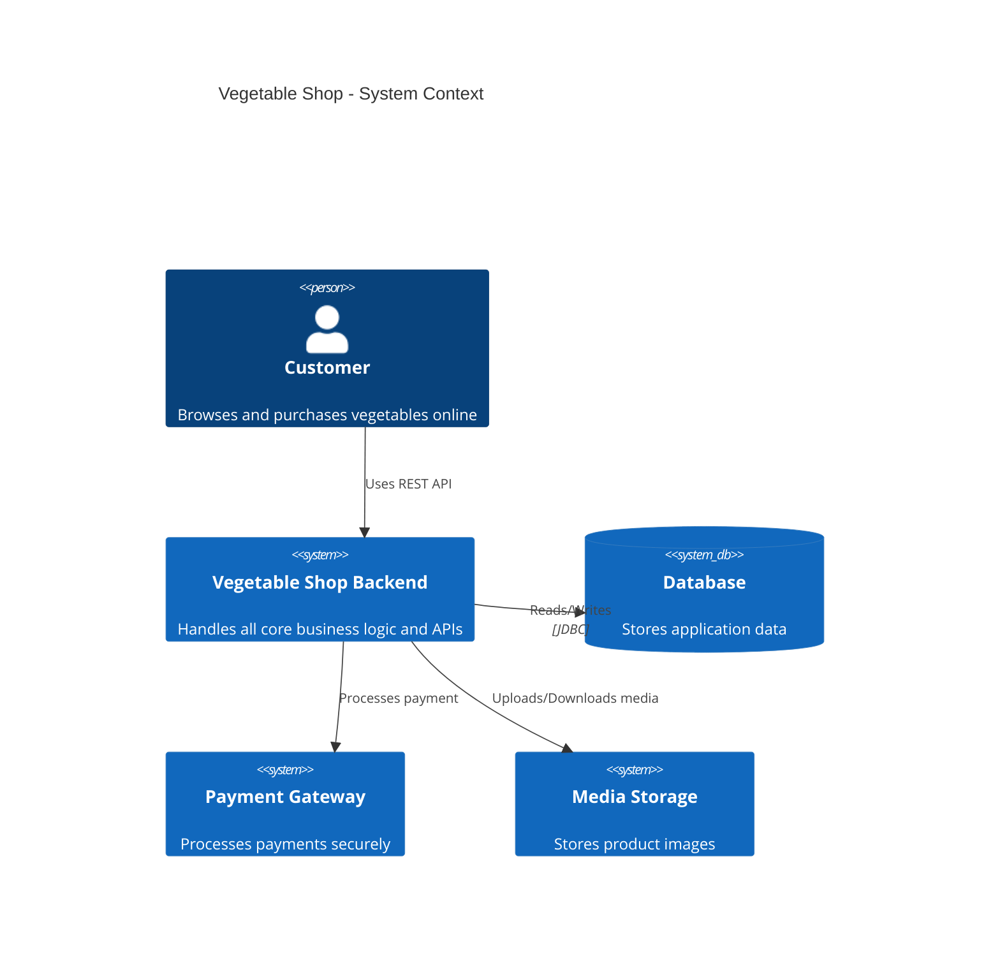
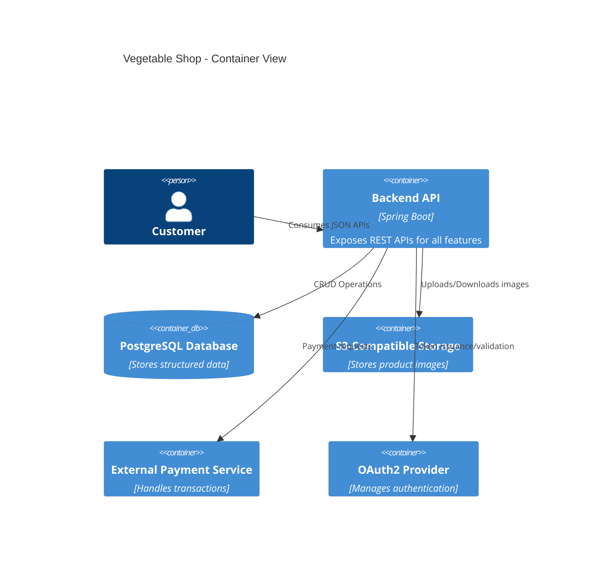
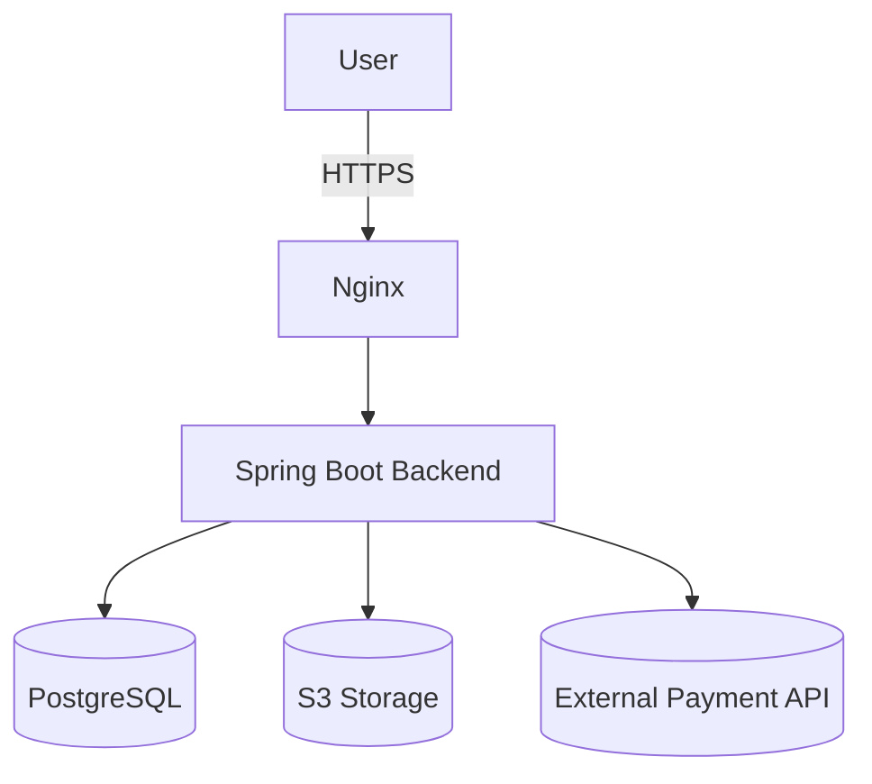

# Vegetable Shop – Architecture Overview

## Table of Contents

1. Introduction
2. System Context
3. Container View (C4 Model – Level 2)
4. Component View (C4 Model – Level 3)
5. Bounded Contexts & Domain Model
6. Layered Architecture
7. Deployment Diagram
8. Cross-Cutting Concerns
9. Security Considerations
10. Observability & Monitoring
11. Scalability & Future Improvements

---

## 1. Introduction

The **Vegetable Shop Backend** is a Spring Boot–based microservice providing authentication, order management, inventory, pricing, and media handling for an e-commerce platform. It follows **Clean Architecture** and **Domain-Driven Design (DDD)** principles, ensuring separation of concerns, scalability, and maintainability.

---

## 2. System Context



---

## 3. Container View (C4 Model – Level 2)



---

## 4. Component View (C4 Model – Level 3)

Main packages/components:

* **auth** – Authentication, authorization, MFA, token handling.
* **order** – Order placement, status transitions, payments.
* **inventory** – Stock tracking, batch management.
* **pricing** – Coupons, promotions, price calculations.
* **media** – Image upload, validation, transformation.
* **core** – Exception handling, validation, tracing, response wrapping.

---

## 5. Bounded Contexts & Domain Model

| Bounded Context | Responsibilities                        |
| --------------- | --------------------------------------- |
| Auth            | User accounts, login, MFA, sessions     |
| Order           | Order lifecycle, payments, refunds      |
| Inventory       | Stock management, reservations          |
| Pricing         | Pricing rules, coupons, promotions      |
| Media           | Product images upload & processing      |
| Common/Core     | Shared DTOs, validation, error handling |

---

## 6. Layered Architecture

```text
┌───────────────────────────────────────────────┐
│ Presentation Layer (Controllers, DTOs)        │
├───────────────────────────────────────────────┤
│ Application Layer (Services, Use Cases)       │
├───────────────────────────────────────────────┤
│ Domain Layer (Entities, Value Objects)        │
├───────────────────────────────────────────────┤
│ Infrastructure Layer (Repositories, Adapters) │
└───────────────────────────────────────────────┘
```

---

## 7. Deployment Diagram



---

## 8. Cross-Cutting Concerns

* **Global Exception Handling** via `GlobalExceptionHandler`
* **Response Wrapping** via `GlobalResponseAdvice`
* **Traceability** with `TraceIdFilter`
* **Validation & Sanitization** via `ValidationErrorExtractor` & `RejectedValueSanitizer`

---

## 9. Security Considerations

* JWT-based stateless authentication
* MFA for high-privilege operations
* IP/device-based anomaly detection
* Input validation & XSS/SQL injection prevention
* Sensitive field masking in logs

---

## 10. Observability & Monitoring

* **Logging:** Structured JSON logs
* **Tracing:** Trace ID propagation across requests
* **Metrics:** Exposed via `/actuator/metrics`
* **Health Checks:** `/actuator/health` endpoints

---

## 11. Scalability & Future Improvements

* Horizontal scaling with container orchestration (Kubernetes)
* Caching layer (Redis) for session & frequently accessed data
* Async processing with message queues (RabbitMQ/Kafka)
* GraphQL API for richer client querying
